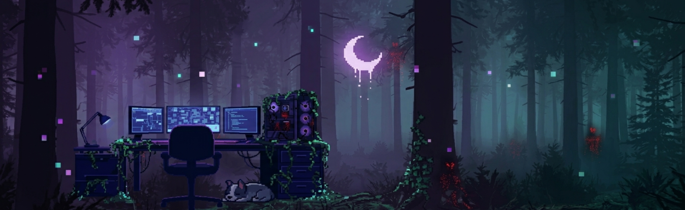

#  RousseGamesStudio
  

### 👾 Desarrollador Indie | Terror Psicológico | Pixel Art 👾

---

"Haciendo juegos de terror con píxeles y mucho café."

  
  
  
  
  

## ✍️ Sobre mí
¡Hola! Soy **Rousse**. Actualmente me estoy dedicando a desarrollar juegos de terror psicológico en 2D. Me enfoco bastante en la narrativa y en que el pixel art logre transmitir esa vibra oscura que busco.

Para mis proyectos uso principalmente **RPG Maker MZ** y **XP**, y diseño todos los personajes y entornos en **Aseprite**.

---

## 🛠️ Herramientas

  
  
  

## 🚀 En qué estoy trabajando
- 🕯️ **Proyecto de Terror:** Un juego 2D sobre la historia de un hermano y su hermana.
- 🎨 **Pixel Art:** Creando tilesets y animaciones (64x64) para el juego.

---

  

